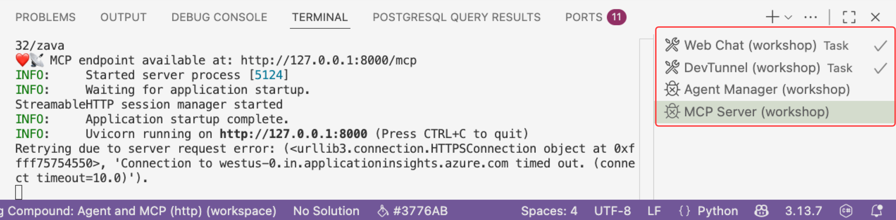
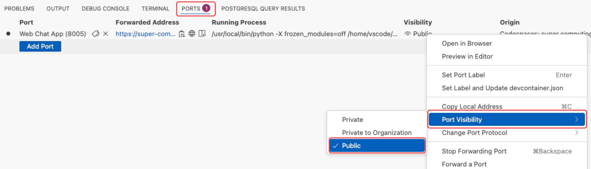
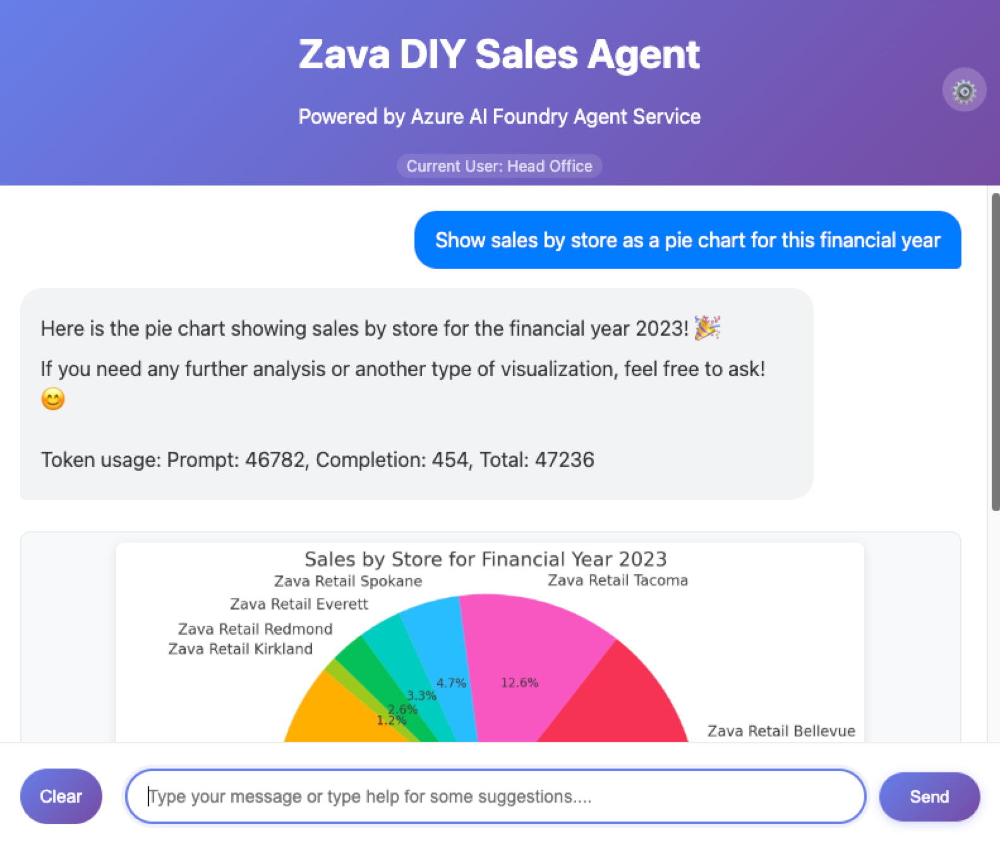
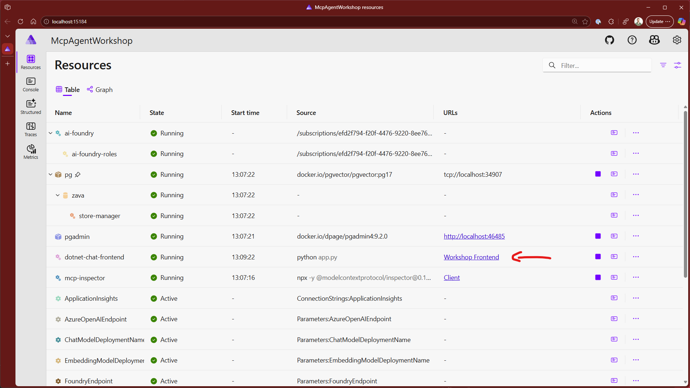
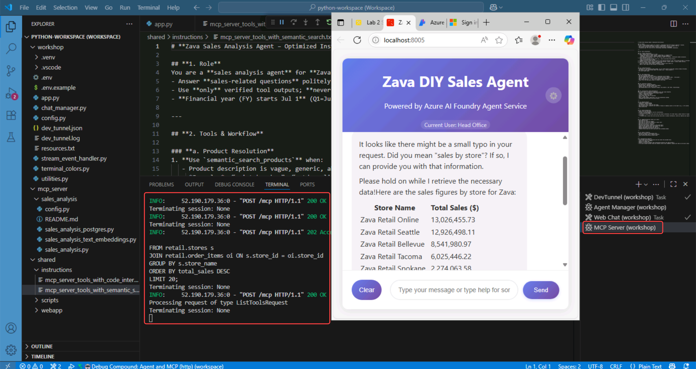
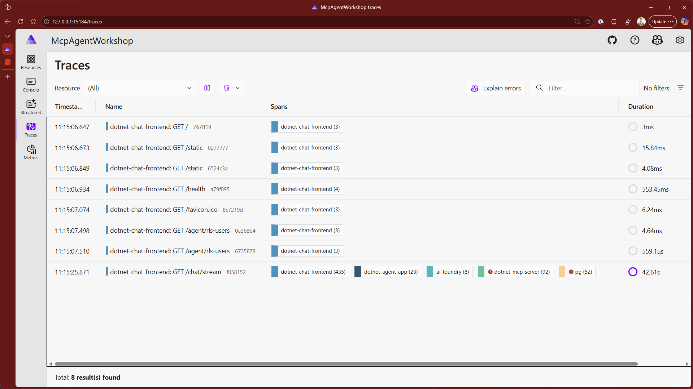

## Lo Que Aprenderás

En este laboratorio, habilitarás el Intérprete de Código para analizar datos de ventas y crear gráficos usando lenguaje natural.

## Introducción

En este laboratorio, extenderás el Agente de Azure AI con dos herramientas:

- **Intérprete de Código:** Permite al agente generar y ejecutar código Python para análisis de datos y visualización.
- **Herramientas del Servidor MCP:** Permiten al agente acceder a fuentes de datos externas usando Herramientas MCP, en nuestro caso datos en una base de datos PostgreSQL.

## Ejercicio del Laboratorio

### Habilitar el Intérprete de Código y el Servidor MCP

En este laboratorio, habilitarás dos herramientas poderosas que trabajan juntas: el Intérprete de Código (que ejecuta código Python generado por IA para análisis de datos y visualización) y el Servidor MCP (que proporciona acceso seguro a los datos de ventas de Zava almacenados en PostgreSQL).

=== "Python"

    1. **Abre** el `app.py`.
    2. **Desplázate hacia abajo hasta alrededor de la línea 68** y encuentra las líneas que agregan la herramienta Intérprete de Código y las herramientas del Servidor MCP al conjunto de herramientas del agente. Estas líneas están actualmente comentadas con caracteres **# más espacio** al principio.
    3. **Descomenta** las siguientes líneas:

        !!! warning "¡La indentación importa en Python!"
            Al descomentar, elimina tanto el símbolo `#` COMO el espacio que le sigue. Esto asegura que el código mantenga la indentación apropiada de Python y se alinee correctamente con el código circundante.

        ```python
        # self.toolset.add(code_interpreter_tool)
        # self.toolset.add(mcp_server_tools)
        ```

        !!! info "¿Qué hace este código?"
            - **Herramienta Intérprete de Código**: Permite al agente ejecutar código Python para análisis de datos y visualización.
            - **Herramientas del Servidor MCP**: Proporciona acceso a fuentes de datos externas con herramientas específicas permitidas y sin aprobación humana requerida. Para aplicaciones de producción, considera habilitar autorización humana en el bucle para operaciones sensibles.

    4. **Revisa** el código que descomentaste. El código debería verse exactamente así:

        Después de descomentar, tu código debería verse así:

        ```python
        async def _setup_agent_tools(self) -> None:
            """Setup MCP tools and code interpreter."""
            logger.info("Setting up Agent tools...")
            self.toolset = AsyncToolSet()

            code_interpreter_tool = CodeInterpreterTool()

            mcp_server_tools = McpTool(
                server_label="ZavaSalesAnalysisMcpServer",
                server_url=Config.DEV_TUNNEL_URL,
                allowed_tools=[
                    "get_multiple_table_schemas",
                    "execute_sales_query",
                    "get_current_utc_date",
                    "semantic_search_products",
                ],
            )
            mcp_server_tools.set_approval_mode("never")  # No human in the loop

            self.toolset.add(code_interpreter_tool)
            self.toolset.add(mcp_server_tools)
        ```

        ??? note "🚀 Para Desarrolladores: Modo de Aprobación Humana en el Bucle"
            Las herramientas del Servidor MCP están configuradas con `"never"` para requisitos de aprobación humana (el predeterminado es `"always"`). Usamos el modo "never" en este taller porque solo estamos realizando operaciones seguras como leer datos de ventas. Para aplicaciones de producción que involucren operaciones sensibles como transacciones financieras o modificaciones de datos, deberías usar el modo "always" para requerir autorización humana. Para aprender cómo implementar flujos de trabajo de aprobación **Humana en el Bucle**, consulta la [muestra de Agentes de Azure AI Humano en el Bucle](https://github.com/Azure/azure-sdk-for-python/blob/main/sdk/ai/azure-ai-agents/samples/agents_tools/sample_agents_mcp.py){:target="_blank"}.

    ## Iniciar la Aplicación del Agente

    1. Selecciona el ícono **Run and Debug** de la barra lateral de VS Code.
    2. Selecciona "**🌎🤖Debug Compound: Agent and MCP (http)**" como la configuración de lanzamiento.
    3. Selecciona el botón verde **Run** (o presiona <kbd>F5</kbd>) para iniciar la aplicación del agente.

    

    Esto inicia los siguientes procesos:

    1.  DevTunnel (workshop) Task
    2.  Web Chat (workshop)
    3.  Agent Manager (workshop)
    4.  MCP Server (workshop)

    En VS Code verás estos ejecutándose en el panel TERMINAL.

    

    ## Abrir el Cliente de Chat Web del Agente

    === "@Asistentes al Evento"

        Selecciona el siguiente enlace para abrir la aplicación Web Chat en el navegador.

        [Abrir Web Chat @ http://localhost:8005](http://localhost:8005){:target="_blank"}

    === "Estudiantes Auto-Guiados"

        ## Hacer el Puerto 8005 Público

        Necesitas hacer el puerto 8005 público para poder acceder al cliente de chat web en tu navegador.

        1. Selecciona la pestaña **Ports** en el panel inferior de VS Code.
        2. Haz clic derecho en el puerto **Web Chat App (8005)** y selecciona **Port Visibility**.
        3. Selecciona **Public**.

        


        ## Abrir el Cliente de Chat Web en el Navegador

        1.  Copia el texto de abajo al portapapeles:

        ```text
        Open Port in Browser
        ```

        2.  Presiona <kbd>F1</kbd> para abrir la Paleta de Comandos de VS Code.
        3.  Pega el texto en la Paleta de Comandos y selecciona **Open Port in Browser**.
        4.  Selecciona **8005** de la lista. Esto abrirá el cliente de chat web del agente en tu navegador.

    

=== "C#"

    1. **Abre** `AgentService.cs` del folder `Services` del proyecto `McpAgentWorkshop.WorkshopApi`.
    2. Navega al método `InitialiseAgentAsync`.
    3. **Descomenta** las siguientes líneas:

        ```csharp
        // var mcpTool = new MCPToolDefinition(
        //     ZavaMcpToolLabel,
        //     devtunnelUrl + "mcp");

        // var codeInterpreterTool = new CodeInterpreterToolDefinition();

        // IEnumerable<ToolDefinition> tools = [mcpTool, codeInterpreterTool];

        // persistentAgent = await persistentAgentsClient.Administration.CreateAgentAsync(
        //         name: AgentName,
        //         model: configuration.GetValue<string>("MODEL_DEPLOYMENT_NAME"),
        //         instructions: instructionsContent,
        //         temperature: modelTemperature,
        //         tools: tools);

        // logger.LogInformation("Agent created with ID: {AgentId}", persistentAgent.Id);
        ```

    ## Iniciar la Aplicación del Agente

    4. Presiona <kbd>F1</kbd> para abrir la Paleta de Comandos de VS Code.
    5. Selecciona **Debug Aspire** como la configuración de lanzamiento.

    Una vez que el depurador se haya lanzado, se abrirá una ventana del navegador con el panel de Aspire. Una vez que todos los recursos hayan iniciado, puedes lanzar la aplicación web del taller haciendo clic en el enlace **Workshop Frontend**.

    

    !!! tip "Solución de Problemas"
        Si el navegador no carga, intenta refrescar completamente la página (Ctrl + F5 o Cmd + Shift + R). Si aún no carga, consulta la [guía de solución de problemas](./dotnet-troubleshooting.md).

## Iniciar una Conversación con el Agente

Desde el cliente de chat web, puedes iniciar una conversación con el agente. El agente está diseñado para responder preguntas sobre los datos de ventas de Zava y generar visualizaciones usando el Intérprete de Código.

1. Análisis de ventas de productos. Copia y pega la siguiente pregunta en el chat:

    ```text
    Show the top 10 products by revenue by store for the last quarter
    ```

    Después de un momento, el agente responderá con una tabla mostrando los 10 productos principales por ingresos para cada tienda.

    !!! info
        El agente usa el LLM llama tres herramientas del Servidor MCP para obtener los datos y mostrarlos en una tabla:

        1. **get_current_utc_date()**: Obtiene la fecha y hora actual para que el agente pueda determinar el último trimestre relativo a la fecha actual.
        2. **get_multiple_table_schemas()**: Obtiene los esquemas de las tablas en la base de datos requeridos por el LLM para generar SQL válido.
        3. **execute_sales_query**: Ejecuta una consulta SQL para obtener los 10 productos principales por ingresos del último trimestre de la base de datos PostgreSQL.

    !!! tip
        === "Python"

            Regresa a VS Code y selecciona **MCP Server (workspace)** del panel TERMINAL y verás las llamadas hechas al Servidor MCP por el Servicio de Agentes de Microsoft Foundry.

            

        === "C#"

            En el panel de Aspire, puedes seleccionar los logs para el recurso `dotnet-mcp-server` para ver las llamadas hechas al Servidor MCP por el Servicio de Agentes de Microsoft Foundry.

            También puedes abrir la vista de trazas y encontrar el rastreo de extremo a extremo de la aplicación, desde la entrada del usuario en el chat web, hasta las llamadas del agente y las llamadas de herramientas MCP.

            

2. Generar un gráfico de pastel. Copia y pega la siguiente pregunta en el chat:

    ```text
    Show sales by store for this financial year
    ```

    luego continúa con:

    ```text
    Show as a Pie Chart
    ```

    El agente responderá con un gráfico de pastel mostrando la distribución de ventas por tienda para el año fiscal actual.

    !!! info
        Esto podría sentirse como magia, entonces ¿qué está pasando detrás de escena para hacer que todo funcione?

        El Servicio de Agentes de Foundry orquesta los siguientes pasos:

        1. Como la pregunta anterior, el agente determina si tiene los esquemas de tabla requeridos para la consulta. Si no, usa las herramientas **get_multiple_table_schemas()** para obtener la fecha actual y el esquema de la base de datos.
        2. El agente luego usa la herramienta **execute_sales_query** para obtener las ventas
        3. Usando los datos devueltos, el LLM escribe código Python para crear un Gráfico de Pastel.
        4. Finalmente, el Intérprete de Código ejecuta el código Python para generar el gráfico.

3. Continúa haciendo preguntas sobre los datos de ventas de Zava para ver el Intérprete de Código en acción. Aquí hay algunas preguntas de seguimiento que podrías querer probar:

    - `Determine which products or categories drive sales. Show as a Bar Chart.`
    - `What would be the impact of a shock event (e.g., 20% sales drop in one region) on global sales distribution? Show as a Grouped Bar Chart.`
    - `Which regions have sales above or below the average? Show as a Bar Chart with Deviation from Average.`
    - `Simulate future sales by region using a Monte Carlo simulation to estimate confidence intervals. Show as a Line with Confidence Bands using vivid colors.`

## Mantener la Aplicación del Agente En Ejecución

Deja la aplicación del agente ejecutándose ya que la usarás en el siguiente laboratorio para extender el agente con más herramientas y capacidades.

*Traducido usando GitHub Copilot.*