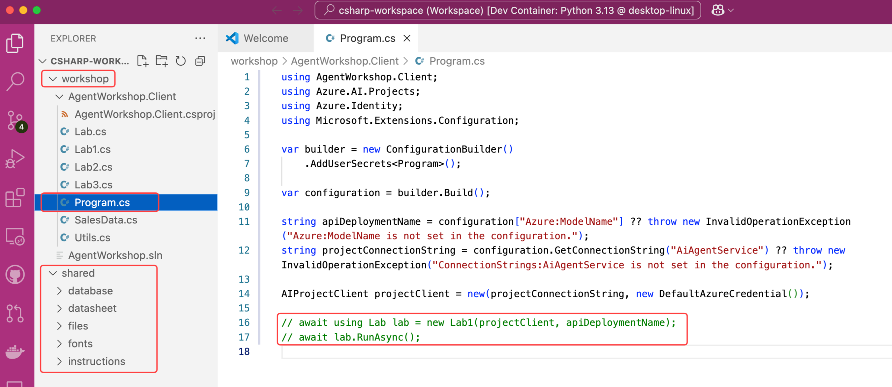

## Opening the Language Workspace

There are two workspaces in the workshop, one for Python and one for C#. The workspace contains the source code and all the files needed to complete the labs for each language. Choose the workspace that matches the language you want to work with.

=== "Python"

    1. Copy the following command to your clipboard:

        ```text
        File: Open Workspace from File...
        ```
    2. Switch to Visual Studio Code, press <kbd>F1</kbd> to open the Command Palette.
    3. Paste the command into the Command Palette and select **Open Workspace from File...**.
    4. Copy and paste the following path into the file picker and press <kbd>Enter</kbd>:

        ```text
        /workspace/.vscode/python-workspace.code-workspace
        ```

    ## Project Structure

    Be sure to familiarize yourself with the key **folders** and **files** you’ll be working with throughout the workshop.

    ### The workshop folder

    - The **app.py** file: The entry point for the app, containing its main logic.
  
    Note the **INSTRUCTIONS_FILE** variable—it sets which instructions file the agent uses. You will update this variable in a later lab.

    - The **resources.txt** file: Contains the resources used by the agent app.
    - The **.env** file: Contains the environment variables used by the agent app.

    ### The mcp_server folder

    - The **sales_analysis.py** file: The MCP Server with tools for sales analysis.

    ### The shared folder

    - The **instructions** folder: Contains the instructions passed to the LLM.

    

=== "C#"

    1. In Visual Studio Code, go to **File** > **Open Workspace from File**.
    2. Replace the default path with the following:

        ```text
        /workspace/.vscode/csharp-workspace.code-workspace
        ```

    3. Select **OK** to open the workspace.

    ## Project Structure

    Be sure to familiarize yourself with the key **folders** and **files** you’ll be working with throughout the workshop.

    ### The workshop folder

    - The **Lab1.cs, Lab2.cs, Lab3.cs** files: The entry point for each lab, containing its agent logic.
    - The **Program.cs** file: The entry point for the app, containing its main logic.
    - The **SalesData.cs** file: The function logic to execute dynamic SQL queries against the SQLite database.

    ### The shared folder

    - The **files** folder: Contains the files created by the agent app.
    - The **fonts** folder: Contains the multilingual fonts used by Code Interpreter.
    - The **instructions** folder: Contains the instructions passed to the LLM.

    
