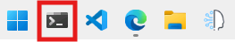

## Asistentes del Evento de Microsoft

Las instrucciones en esta página asumen que estás asistiendo a un evento y tienes acceso a un entorno de laboratorio preconfigurado. Este entorno proporciona una suscripción de Azure con todas las herramientas y recursos necesarios para completar el taller.

## Introducción

Este taller está diseñado para enseñarte sobre el Servicio de Agentes de Azure AI y el [SDK](https://learn.microsoft.com/python/api/overview/azure/ai-projects-readme?context=%2Fazure%2Fai-services%2Fagents%2Fcontext%2Fcontext){:target="_blank"} asociado. Consiste en múltiples laboratorios, cada uno destacando una característica específica del Servicio de Agentes de Azure AI. Los laboratorios están destinados a completarse en orden, ya que cada uno se basa en el conocimiento y trabajo del laboratorio anterior.

## Seleccionar Lenguaje de Programación del Taller

El taller está disponible tanto en Python como en C#. Por favor asegúrate de seleccionar el lenguaje que se ajuste al salón de laboratorio o preferencia usando las pestañas del selector de lenguaje. Nota, no cambies de lenguaje a mitad del taller.

**Selecciona la pestaña de lenguaje que coincida con tu salón de laboratorio:**

=== "Python"
    El lenguaje por defecto para el taller está establecido en **Python**.

## Autenticar con Azure

Necesitas autenticarte con Azure para que la aplicación del agente pueda acceder al Servicio de Agentes de Azure AI y los modelos. Sigue estos pasos:

1. Abre una ventana de terminal. La aplicación de terminal está **fijada** en la barra de tareas de Windows 11.

    { width="300" }

2. Ejecuta el siguiente comando para autenticarte con Azure:

    ```powershell
    az login
    ```

    !!! note
        Se te pedirá que abras un enlace del navegador e inicies sesión en tu cuenta de Azure.

        1. Una ventana del navegador se abrirá automáticamente, selecciona **Work or school account** y luego selecciona **Continue**.
        2. Usa el **Username** y **TAP (Temporary Access Pass)** que se encuentran en la **sección superior** de la pestaña **Resources** en el entorno de laboratorio.
        3. Selecciona **Yes, all apps**
        4. Selecciona **Done**

3. Luego selecciona la suscripción **Default** desde la línea de comandos, seleccionando **Enter**.

4. Deja la ventana de terminal abierta para los siguientes pasos.

## Autenticar con el Servicio DevTunnel

DevTunnel permite al Servicio de Agentes de Azure AI acceder a tu Servidor MCP local durante el taller.

```powershell
devtunnel login
```

!!! note
    Se te pedirá usar la cuenta que usaste para `az login`. Selecciona la cuenta y continúa.

Deja la ventana de terminal abierta para los siguientes pasos.

## Abrir el Taller

Sigue estos pasos para abrir el taller en Visual Studio Code:

=== "Python"

    El siguiente bloque de comandos actualiza el repositorio del taller, activa el entorno virtual de Python y abre el proyecto en VS Code.

    Copia y pega el siguiente bloque de comandos en el terminal y presiona **Enter**.

    ```powershell
    ; cd $HOME\aitour26-WRK540-unlock-your-agents-potential-with-model-context-protocol `
    ; git pull `
    ; .\src\python\workshop\.venv\Scripts\activate `
    ; code .vscode\python-workspace.code-workspace
    ```

    !!! warning "Cuando el proyecto se abre en VS Code, aparecen dos notificaciones en la esquina inferior derecha. Haz clic en ✖ para cerrar ambas notificaciones."

## Estructura del Proyecto

=== "Python"

    Asegúrate de familiarizarte con las **subcarpetas** y **archivos** clave con los que trabajarás durante el taller.

    5. El archivo **main.py**: El punto de entrada para la aplicación, conteniendo su lógica principal.
    6. El archivo **sales_data.py**: La lógica de función para ejecutar consultas SQL dinámicas contra la base de datos SQLite.
    7. El archivo **stream_event_handler.py**: Contiene la lógica del manejador de eventos para streaming de tokens.
    8. La carpeta **shared/files**: Contiene los archivos creados por la aplicación del agente.
    9. La carpeta **shared/instructions**: Contiene las instrucciones pasadas al LLM.

    

## Consejos Profesionales

!!! tips
    1. El **Menú Hamburguesa** en el panel derecho del entorno de laboratorio ofrece características adicionales, incluyendo la **Vista de Ventana Dividida** y la opción de finalizar el laboratorio. La **Vista de Ventana Dividida** te permite maximizar el entorno de laboratorio a pantalla completa, optimizando el espacio de pantalla. El panel de **Instrucciones** y **Recursos** del laboratorio se abrirá en una ventana separada.

*Traducido usando GitHub Copilot.*
