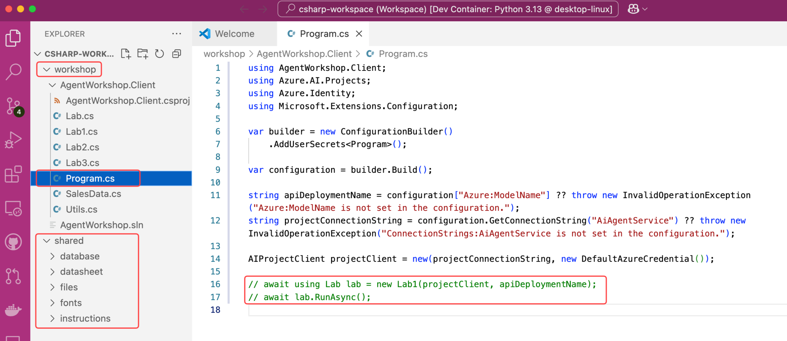

## Participants à l'événement Microsoft

Les instructions de cette page supposent que vous participez à un événement et avez accès à un environnement de lab pré-configuré. Cet environnement fournit un abonnement Azure avec tous les outils et ressources nécessaires pour compléter l'atelier.

## Introduction

Cet atelier est conçu pour vous enseigner le Service d'Agents Azure AI et le [SDK](https://learn.microsoft.com/python/api/overview/azure/ai-projects-readme?context=%2Fazure%2Fai-services%2Fagents%2Fcontext%2Fcontext){:target="_blank"} associé. Il consiste en plusieurs labs, chacun mettant en évidence une fonctionnalité spécifique du Service d'Agents Azure AI. Les labs sont conçus pour être complétés dans l'ordre, car chacun s'appuie sur les connaissances et le travail du lab précédent.

## Ressources cloud de l'atelier

Les ressources suivantes sont pré-provisionnées dans votre abonnement Azure de lab :

- Un groupe de ressources nommé **rg-zava-agent-wks-nnnnnnnn**
- Un **hub Azure AI Foundry** nommé **fdy-zava-agent-wks-nnnnnnnn**
- Un **projet Azure AI Foundry** nommé **prj-zava-agent-wks-nnnnnnnn**
- Deux modèles sont déployés : **gpt-4o-mini** et **text-embedding-3-small**. [Voir la tarification.](https://azure.microsoft.com/pricing/details/cognitive-services/openai-service/){:target="\_blank"}
- Base de données Azure Database for PostgreSQL Flexible Server (B1ms Burstable 32GB) nommée **pg-zava-agent-wks-nnnnnnnn**. [Voir la tarification](https://azure.microsoft.com/pricing/details/postgresql/flexible-server){:target="\_blank"}
- Ressource Application Insights nommée **appi-zava-agent-wks-nnnnnnnn**. [Voir la tarification](https://azure.microsoft.com/pricing/calculator/?service=monitor){:target="\_blank"}

## Sélectionner le langage de programmation de l'atelier

L'atelier est disponible en Python et C#. Assurez-vous de sélectionner le langage qui correspond à la salle de lab ou à votre préférence en utilisant les onglets de sélection de langage. Note, ne changez pas de langage au milieu de l'atelier.

**Sélectionnez l'onglet de langage qui correspond à votre salle de lab :**

=== "Python"
    Le langage par défaut pour l'atelier est défini à **Python**.
=== "C#"
    Le langage par défaut pour l'atelier est défini à **C#**.

    !!! warning "La version C#/.NET de cet atelier est en bêta et présente des problèmes de stabilité connus."

    Assurez-vous de lire la section [guide de dépannage](../../en/dotnet-troubleshooting.md) **AVANT** de commencer l'atelier. Sinon, sélectionnez la version **Python** de l'atelier.

## S'authentifier avec Azure

Vous devez vous authentifier avec Azure pour que l'application agent puisse accéder au Service d'Agents Azure AI et aux modèles. Suivez ces étapes :

1. Ouvrez une fenêtre de terminal. L'application terminal est **épinglée** à la barre des tâches Windows 11.

    { width="300" }

2. Exécutez la commande suivante pour vous authentifier avec Azure :

    ```powershell
    az login
    ```

    !!! note
        Il vous sera demandé d'ouvrir un lien de navigateur et de vous connecter à votre compte Azure.

        1. Une fenêtre de navigateur s'ouvrira automatiquement, sélectionnez **Compte professionnel ou scolaire** puis sélectionnez **Continuer**.
        1. Utilisez le **Nom d'utilisateur** et le **TAP (Pass d'Accès Temporaire)** trouvés dans la **section supérieure** de l'onglet **Ressources** dans l'environnement de lab.
        1. Sélectionnez **Oui, toutes les applications**
        1. Sélectionnez **Terminé**

3. Puis sélectionnez l'abonnement **Par défaut** depuis la ligne de commande, en sélectionnant **Entrée**.

4. Laissez la fenêtre de terminal ouverte pour les étapes suivantes.

## S'authentifier avec le service DevTunnel

DevTunnel permet au Service d'Agents Azure AI d'accéder à votre serveur MCP local pendant l'atelier.

```powershell
devtunnel login
```

!!! note
    Il vous sera demandé d'utiliser le compte que vous avez utilisé pour `az login`. Sélectionnez le compte et continuez.

Laissez la fenêtre de terminal ouverte pour les étapes suivantes.

## Ouvrir l'atelier

Suivez ces étapes pour ouvrir l'atelier dans Visual Studio Code :

=== "Python"

    Le bloc de commandes suivant met à jour le dépôt de l'atelier, active l'environnement virtuel Python et ouvre le projet dans VS Code.

    Copiez et collez le bloc de commandes suivant dans le terminal et appuyez sur **Entrée**.

    ```powershell
    ; cd $HOME\aitour26-WRK540-unlock-your-agents-potential-with-model-context-protocol `
    ; git pull `
    ; .\src\python\workshop\.venv\Scripts\activate `
    ; code .vscode\python-workspace.code-workspace
    ```

    !!! warning "Lorsque le projet s'ouvre dans VS Code, deux notifications apparaissent dans le coin inférieur droit. Cliquez sur ✖ pour fermer les deux notifications."

=== "C#"

    === "VS Code"

        1. Ouvrez l'atelier dans Visual Studio Code. Depuis la fenêtre de terminal, exécutez la commande suivante :

            ```powershell
            ; cd $HOME\aitour26-WRK540-unlock-your-agents-potential-with-model-context-protocol `
            ; git pull `
            ;code .vscode\csharp-workspace.code-workspace
            ```

        !!! note "Lorsque le projet s'ouvre dans VS Code, une notification apparaîtra dans le coin inférieur droit pour installer l'extension C#. Cliquez sur **Installer** pour installer l'extension C#, car cela fournira les fonctionnalités nécessaires pour le développement C#."

    === "Visual Studio 2022"

        2. Ouvrez l'atelier dans Visual Studio 2022. Depuis la fenêtre de terminal, exécutez la commande suivante :

            ```powershell
            ; git pull `
            ;cd $HOME; start .\aitour26-WRK540-unlock-your-agents-potential-with-model-context-protocol\src\csharp\McpAgentWorkshop.slnx
            ```

            !!! note "Il se peut qu'on vous demande avec quel programme ouvrir la solution. Sélectionnez **Visual Studio 2022**."

## Structure du projet

=== "Python"

    Assurez-vous de vous familiariser avec les **sous-dossiers** et **fichiers** clés avec lesquels vous travaillerez tout au long de l'atelier.

    5. Le fichier **main.py** : Le point d'entrée de l'application, contenant sa logique principale.
    6. Le fichier **sales_data.py** : La logique de fonction pour exécuter des requêtes SQL dynamiques contre la base de données SQLite.
    7. Le fichier **stream_event_handler.py** : Contient la logique du gestionnaire d'événements pour le streaming de tokens.
    8. Le dossier **shared/files** : Contient les fichiers créés par l'application agent.
    9. Le dossier **shared/instructions** : Contient les instructions transmises au LLM.

    

=== "C#"

    ## Structure du projet

    Le projet utilise [Aspire](http://aka.ms/dotnet-aspire) pour simplifier la construction de l'application agent, la gestion du serveur MCP et l'orchestration de toutes les dépendances externes. La solution est composée de quatre projets, tous préfixés par `McpAgentWorkshop` :

    * `AppHost` : L'orchestrateur Aspire et le projet de lancement pour l'atelier.
    * `McpServer` : Le projet serveur MCP.
    * `ServiceDefaults` : Configuration par défaut pour les services, tels que la journalisation et la télémétrie.
    * `WorkshopApi` : L'API Agent pour l'atelier. La logique d'application principale est dans la classe `AgentService`.

    En plus des projets .NET dans la solution, il y a un dossier `shared` (visible comme un dossier de solution et via l'explorateur de fichiers), qui contient :

    * `instructions` : Les instructions transmises au LLM.
    * `scripts` : Scripts shell d'aide pour diverses tâches, ceux-ci seront référencés quand nécessaire.
    * `webapp` : L'application client front-end. Remarque : Il s'agit d'une application Python, dont Aspire gérera le cycle de vie.

    

## Conseils de pro

!!! tips
    1. Le **Menu Burger** dans le panneau de droite de l'environnement de lab offre des fonctionnalités supplémentaires, y compris la **Vue de fenêtre partagée** et l'option pour terminer le lab. La **Vue de fenêtre partagée** vous permet de maximiser l'environnement de lab en plein écran, optimisant l'espace d'écran. Le panneau **Instructions** et **Ressources** du lab s'ouvrira dans une fenêtre séparée.

*Traduit en utilisant GitHub Copilot.*
