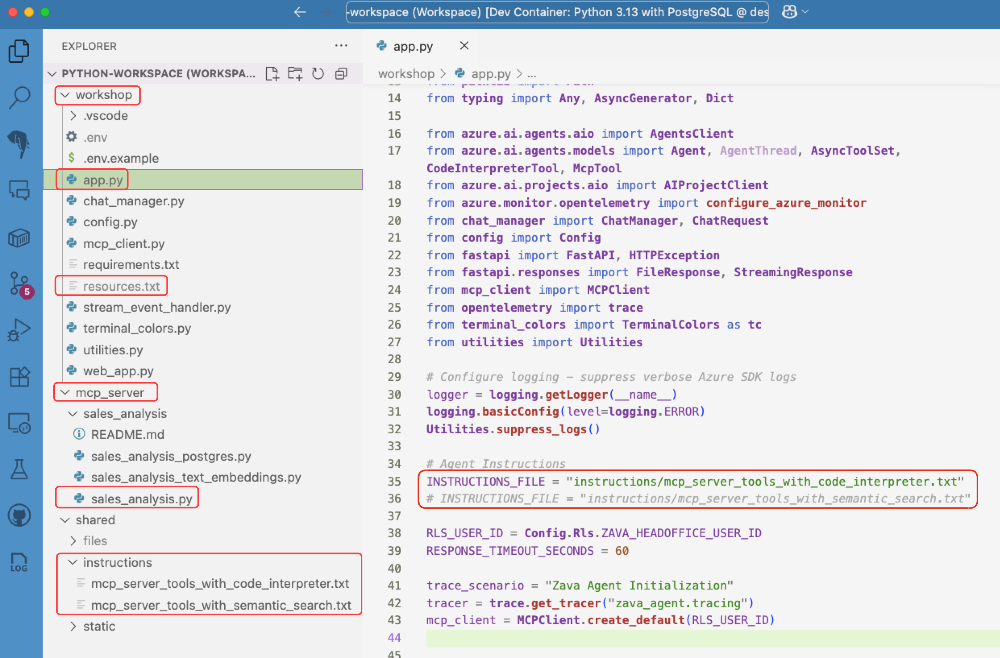

## Apprenants auto-guidés

Ces instructions sont destinées aux apprenants auto-guidés qui n'ont pas accès à un environnement de lab pré-configuré. Suivez ces étapes pour configurer votre environnement et commencer l'atelier.

## Introduction

Cet atelier est conçu pour vous enseigner le Service d'Agents Azure AI et le SDK associé. Il consiste en plusieurs labs, chacun mettant en évidence une fonctionnalité spécifique du Service d'Agents Azure AI. Les labs sont conçus pour être complétés dans l'ordre, car chacun s'appuie sur les connaissances et le travail du lab précédent.

## Prérequis

1. Accès à un abonnement Azure. Si vous n'avez pas d'abonnement Azure, créez un [compte gratuit](https://azure.microsoft.com/free/){:target="_blank"} avant de commencer.
1. Vous avez besoin d'un compte GitHub. Si vous n'en avez pas, créez-le sur [GitHub](https://github.com/join){:target="_blank"}.

## Sélectionner le langage de programmation de l'atelier

L'atelier est disponible en Python et C#. Utilisez les onglets de sélection de langage pour choisir votre langage préféré. Remarque, ne changez pas de langage au milieu de l'atelier.

**Sélectionnez l'onglet pour votre langage préféré :**

=== "Python"
    Le langage par défaut pour l'atelier est défini à **Python**.
=== "C#"
    Le langage par défaut pour l'atelier est défini à **C#**.

    !!! warning "La version C#/.NET de cet atelier est en bêta et présente des problèmes de stabilité connus."

    Assurez-vous de lire la section [guide de dépannage](../../en/dotnet-troubleshooting.md) **AVANT** de commencer l'atelier. Sinon, sélectionnez la version **Python** de l'atelier.

## Ouvrir l'atelier

Préféré : **GitHub Codespaces**, qui fournit un environnement préconfiguré avec tous les outils requis. Alternativement, exécutez localement avec un **Dev Container** Visual Studio Code et **Docker**. Utilisez les onglets ci-dessous pour choisir.

!!! Tip
    La construction de Codespaces ou Dev Container prend environ 5 minutes. Démarrez la construction, puis **continuez à lire** pendant qu'elle se termine.

=== "GitHub Codespaces"

    Sélectionnez **Ouvrir dans GitHub Codespaces** pour ouvrir le projet dans GitHub Codespaces.

    [](https://codespaces.new/microsoft/aitour26-WRK540-unlock-your-agents-potential-with-model-context-protocol){:target="_blank"}

=== "VS Code Dev Container"

    1. Assurez-vous d'avoir les éléments suivants installés sur votre machine locale :

        - [Docker](https://docs.docker.com/get-docker/){:target="\_blank"}
        - [Visual Studio Code](https://code.visualstudio.com/download){:target="\_blank"}
        - L'[extension Remote - Containers](https://marketplace.visualstudio.com/items?itemName=ms-vscode-remote.remote-containers){:target="\_blank"}
    1. Clonez le dépôt sur votre machine locale :

        ```bash
        git clone https://github.com/microsoft/aitour26-WRK540-unlock-your-agents-potential-with-model-context-protocol.git
        ```

    1. Ouvrez le dépôt cloné dans Visual Studio Code.
    1. Quand on vous le demande, sélectionnez **Rouvrir dans le conteneur** pour ouvrir le projet dans un Dev Container.

---

## Authentifier les services Azure

!!! danger
Avant de continuer, assurez-vous que votre Codespace ou Dev Container est entièrement construit et prêt.

### S'authentifier avec DevTunnel

DevTunnel fournit un service de redirection de port qui sera utilisé dans l'atelier pour permettre au Service d'Agents Azure AI d'accéder au serveur MCP que vous exécuterez sur votre environnement de développement local. Suivez ces étapes pour vous authentifier :

1. Depuis VS Code, **appuyez** sur <kbd>Ctrl</kbd> + <kbd>Shift</kbd> + <kbd>`</kbd> pour ouvrir une nouvelle fenêtre de terminal. Puis exécutez la commande suivante :
1. **Exécutez la commande suivante** pour vous authentifier avec DevTunnel :

   ```shell
   devtunnel login
   ```

1. Suivez ces étapes pour vous authentifier :

   1. Copiez le **Code d'authentification** dans le presse-papiers.
   2. **Maintenez appuyée** la touche <kbd>ctrl</kbd> ou <kbd>cmd</kbd>.
   3. **Sélectionnez** l'URL d'authentification pour l'ouvrir dans votre navigateur.
   4. **Collez** le code et cliquez sur **Suivant**.
   5. **Choisissez un compte** et connectez-vous.
   6. Sélectionnez **Continuer**
   7. **Retournez** à la fenêtre de terminal dans VS Code.

1. Laissez la fenêtre de terminal **ouverte** pour les étapes suivantes.

### S'authentifier avec Azure

Authentifiez-vous avec Azure pour permettre à l'application agent d'accéder au Service d'Agents Azure AI et aux modèles. Suivez ces étapes :

1. Puis exécutez la commande suivante :

    ```shell
    az login --use-device-code
    ```

    !!! warning
    Si vous avez plusieurs locataires Azure, spécifiez le bon en utilisant :

    ```shell
    az login --use-device-code --tenant <tenant_id>
    ```

2. Suivez ces étapes pour vous authentifier :

    1. **Copiez** le **Code d'authentification** dans le presse-papiers.
    2. **Maintenez appuyée** la touche <kbd>ctrl</kbd> ou <kbd>cmd</kbd>.
    3. **Sélectionnez** l'URL d'authentification pour l'ouvrir dans votre navigateur.
    4. **Collez** le code et cliquez sur **Suivant**.
    5. **Choisissez un compte** et connectez-vous.
    6. Sélectionnez **Continuer**
    7. **Retournez** à la fenêtre de terminal dans VS Code.
    8. Si on vous le demande, **sélectionnez** un abonnement.

3. Laissez la fenêtre de terminal ouverte pour les étapes suivantes.

---

## Déployer les ressources Azure

Ce déploiement crée les ressources suivantes dans votre abonnement Azure.

- Un groupe de ressources nommé **rg-zava-agent-wks-nnnnnnnn**
- Un **hub Azure AI Foundry** nommé **fdy-zava-agent-wks-nnnnnnnn**
- Un **projet Azure AI Foundry** nommé **prj-zava-agent-wks-nnnnnnnn**
- Deux modèles sont déployés : **gpt-4o-mini** et **text-embedding-3-small**. [Voir la tarification.](https://azure.microsoft.com/pricing/details/cognitive-services/openai-service/){:target="\_blank"}
- Ressource Application Insights nommée **appi-zava-agent-wks-nnnnnnnn**. [Voir la tarification](https://azure.microsoft.com/pricing/calculator/?service=monitor){:target="\_blank"}
- Pour maintenir les coûts de l'atelier bas, PostgreSQL s'exécute dans un conteneur local dans votre Codespace ou Dev Container plutôt que comme un service cloud. Voir [Azure Database for PostgreSQL Flexible Server](https://azure.microsoft.com/en-us/products/postgresql){:target="\_blank"} pour en apprendre davantage sur les options pour un service PostgreSQL géré.

!!! warning "Assurez-vous d'avoir au moins les quotas de modèle suivants" - Quota de 120K TPM pour le SKU gpt-4o-mini Global Standard, car l'agent fait des appels fréquents au modèle. - 50K TPM pour le modèle text-embedding-3-small SKU Global Standard. - Vérifiez votre quota dans le [Centre de gestion AI Foundry](https://ai.azure.com/managementCenter/quota){:target="\_blank"}.

### Déploiement automatisé

Exécutez le script bash suivant pour automatiser le déploiement des ressources requises pour l'atelier. Le script `deploy.sh` déploie les ressources dans la région `westus` par défaut. Pour exécuter le script :

```bash
cd infra && ./deploy.sh
```

### Configuration de l'atelier

=== "Python"

    #### Configuration des ressources Azure

    Le script de déploiement génère le fichier **.env**, qui contient les points de terminaison du projet et du modèle, les noms de déploiement des modèles et la chaîne de connexion Application Insights. Le fichier .env sera automatiquement sauvegardé dans le dossier `src/python/workshop`.

    Votre fichier **.env** ressemblera à ce qui suit, mis à jour avec vos valeurs :

    ```python
    PROJECT_ENDPOINT="<your_project_endpoint>"
    GPT_MODEL_DEPLOYMENT_NAME="<your_model_deployment_name>"
    EMBEDDING_MODEL_DEPLOYMENT_NAME="<your_embedding_model_deployment_name>"
    APPLICATIONINSIGHTS_CONNECTION_STRING="<your_application_insights_connection_string>"
    AZURE_TRACING_GEN_AI_CONTENT_RECORDING_ENABLED="true"
    AZURE_OPENAI_ENDPOINT="<your_azure_openai_endpoint>"
    ```

    #### Noms des ressources Azure

    Vous trouverez également un fichier nommé `resources.txt` dans le dossier `workshop`. Ce fichier contient les noms des ressources Azure créées pendant le déploiement.

    Il ressemblera à ce qui suit :

    ```plaintext
    Ressources Azure AI Foundry :
    - Nom du groupe de ressources : rg-zava-agent-wks-nnnnnnnn
    - Nom du projet AI : prj-zava-agent-wks-nnnnnnnn
    - Nom de la ressource Foundry : fdy-zava-agent-wks-nnnnnnnn
    - Nom d'Application Insights : appi-zava-agent-wks-nnnnnnnn
    ```

=== "C#"

    Le script stocke de manière sécurisée les variables de projet en utilisant le Secret Manager pour [les secrets de développement ASP.NET Core](https://learn.microsoft.com/aspnet/core/security/app-secrets){:target="_blank"}.

    Vous pouvez visualiser les secrets en exécutant la commande suivante après avoir ouvert l'espace de travail C# dans VS Code :

    ```bash
    dotnet user-secrets list
    ```

---

## Ouvrir l'espace de travail VS Code

Il y a deux espaces de travail VS Code dans l'atelier, un pour Python et un pour C#. L'espace de travail contient le code source et tous les fichiers nécessaires pour compléter les labs pour chaque langage. Choisissez l'espace de travail qui correspond au langage avec lequel vous voulez travailler.

=== "Python"

    1. **Copiez** le chemin suivant dans le presse-papiers :

        ```text
        /workspace/.vscode/python-workspace.code-workspace
        ```
    1. Depuis le menu VS Code, sélectionnez **Fichier** puis **Ouvrir l'espace de travail depuis un fichier**.
    3. Remplacez et **collez** le nom de chemin copié et sélectionnez **OK**.


    ## Structure du projet

    Familiarisez-vous avec les **dossiers** et **fichiers** clés dans l'espace de travail avec lesquels vous travaillerez tout au long de l'atelier.

    ### Le dossier "workshop"

    - Le fichier **app.py** : Le point d'entrée de l'application, contenant sa logique principale.

    Notez la variable **INSTRUCTIONS_FILE**—elle définit quel fichier d'instructions l'agent utilise. Vous mettrez à jour cette variable dans un lab ultérieur.

    - Le fichier **resources.txt** : Contient les ressources utilisées par l'application agent.
    - Le fichier **.env** : Contient les variables d'environnement utilisées par l'application agent.

    ### Le dossier "mcp_server"

    - Le fichier **sales_analysis.py** : Le serveur MCP avec des outils pour l'analyse des ventes.

    ### Le dossier "shared/instructions"

    - Le dossier **instructions** : Contient les instructions transmises au LLM.

    

=== "C#"

    1. Dans Visual Studio Code, allez à **Fichier** > **Ouvrir l'espace de travail depuis un fichier**.
    2. Remplacez le chemin par défaut par le suivant :

        ```text
        /workspace/.vscode/csharp-workspace.code-workspace
        ```

    3. Sélectionnez **OK** pour ouvrir l'espace de travail.

    ## Structure du projet

    Le projet utilise [Aspire](http://aka.ms/dotnet-aspire) pour simplifier la construction de l'application agent, la gestion du serveur MCP et l'orchestration de toutes les dépendances externes. La solution est composée de quatre projets, tous préfixés par `McpAgentWorkshop` :

    * `AppHost` : L'orchestrateur Aspire et le projet de lancement pour l'atelier.
    * `McpServer` : Le projet serveur MCP.
    * `ServiceDefaults` : Configuration par défaut pour les services, tels que la journalisation et la télémétrie.
    * `WorkshopApi` : L'API Agent pour l'atelier. La logique d'application principale est dans la classe `AgentService`.

    En plus des projets .NET dans la solution, il y a un dossier `shared` (visible comme un dossier de solution et via l'explorateur de fichiers), qui contient :

    * `instructions` : Les instructions transmises au LLM.
    * `scripts` : Scripts shell d'aide pour diverses tâches, ceux-ci seront référencés quand nécessaire.
    * `webapp` : L'application client front-end. Remarque : Il s'agit d'une application Python, dont Aspire gérera le cycle de vie.

    

*Traduit en utilisant GitHub Copilot.*
