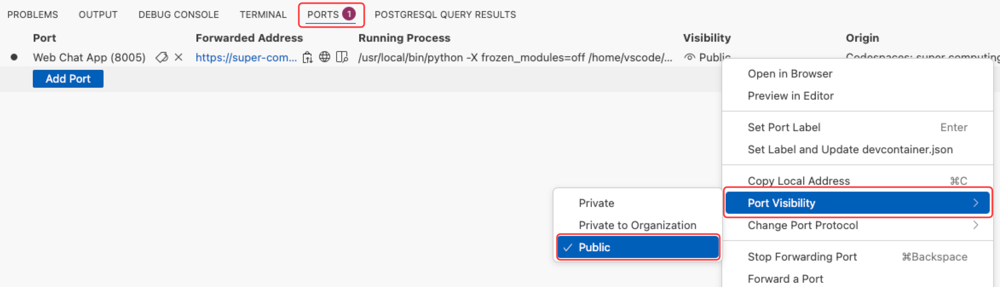

## 학습 내용

이 실습에서는 코드 인터프리터를 활성화하여 자연어를 사용해 판매 데이터를 분석하고 차트를 생성합니다.

## 소개

이 실습에서는 Azure AI 에이전트를 두 가지 도구로 확장합니다:

- **코드 인터프리터:** 에이전트가 데이터 분석과 시각화를 위해 Python 코드를 생성하고 실행할 수 있게 합니다.
- **MCP 서버 도구:** 에이전트가 MCP 도구를 사용하여 외부 데이터 소스에 액세스할 수 있게 하며, 우리의 경우 PostgreSQL 데이터베이스의 데이터입니다.

## 실습 연습

### 코드 인터프리터와 MCP 서버 활성화

이 실습에서는 함께 작동하는 두 가지 강력한 도구를 활성화합니다: 코드 인터프리터(데이터 분석 및 시각화를 위해 AI 생성 Python 코드를 실행)와 MCP 서버(PostgreSQL에 저장된 Zava의 판매 데이터에 대한 안전한 액세스를 제공).

=== "Python"

    1. **열기** `app.py` 파일을.
    2. **67번째 줄까지 스크롤**하여 에이전트의 도구 세트에 코드 인터프리터 도구와 MCP 서버 도구를 추가하는 줄을 찾습니다. 이 줄들은 현재 시작 부분에 **# 플러스 공백** 문자로 주석 처리되어 있습니다.
    3. **주석 해제** 다음 줄들을:

        !!! warning "Python에서는 들여쓰기가 중요합니다!"
            주석을 해제할 때는 `#` 기호와 그 다음에 오는 공백을 모두 삭제하세요. 이렇게 하면 코드가 적절한 Python 들여쓰기를 유지하고 주변 코드와 올바르게 정렬됩니다.

        ```python
        # self.toolset.add(code_interpreter_tool)
        # self.toolset.add(mcp_server_tools)
        ```

        !!! info "이 코드는 무엇을 하나요?"
            - **코드 인터프리터 도구**: 에이전트가 데이터 분석과 시각화를 위해 Python 코드를 실행할 수 있게 합니다.
            - **MCP 서버 도구**: 특정 허용된 도구로 외부 데이터 소스에 대한 액세스를 제공하며 인간의 승인이 필요하지 않습니다. 프로덕션 애플리케이션의 경우 민감한 작업에 대해 휴먼 인 더 루프 인증을 활성화하는 것을 고려하세요.

    4. **검토** 주석을 해제한 코드를. 코드는 정확히 다음과 같아야 합니다:

        주석을 해제한 후, 코드는 다음과 같아야 합니다:

        ```python
        async def _setup_agent_tools(self) -> None:
            """Setup MCP tools and code interpreter."""
            logger.info("Setting up Agent tools...")
            self.toolset = AsyncToolSet()

            code_interpreter_tool = CodeInterpreterTool()

            mcp_server_tools = McpTool(
                server_label="ZavaSalesAnalysisMcpServer",
                server_url=Config.DEV_TUNNEL_URL,
                allowed_tools=[
                    "get_multiple_table_schemas",
                    "execute_sales_query",
                    "get_current_utc_date",
                    "semantic_search_products",
                ],
            )
            mcp_server_tools.set_approval_mode("never")  # No human in the loop

            self.toolset.add(code_interpreter_tool)
            self.toolset.add(mcp_server_tools)
        ```

    ## 에이전트 앱 시작

    1. 아래 텍스트를 클립보드에 복사:

    ```text
    Debug: Select and Start Debugging
    ```

    1. <kbd>F1</kbd>을 눌러 VS Code 명령 팔레트를 엽니다.
    1. 텍스트를 명령 팔레트에 붙여넣고 **Debug: Select and Start Debugging**을 선택합니다.
    1. 목록에서 **🌎🤖Debug Compound: Agent and MCP (http)**를 선택합니다. 이것은 에이전트 앱과 웹 채팅 클라이언트를 시작합니다.

    이것은 다음 프로세스들을 시작합니다:

    1.  DevTunnel (workshop) Task
    2.  Web Chat (workshop)
    3.  Agent Manager (workshop)
    4.  MCP Server (workshop)

    VS Code의 TERMINAL 패널에서 이들이 실행되는 것을 볼 수 있습니다.

    

    ## 에이전트 웹 채팅 클라이언트 열기

    === "@이벤트 참가자"

        다음 링크를 선택하여 브라우저에서 웹 채팅 앱을 엽니다.

        [웹 채팅 열기](http://localhost:8005){:target="_blank"}

    === "자율 학습자"

        ## 포트 8005를 공개하기

        브라우저에서 웹 채팅 클라이언트에 액세스하려면 포트 8005를 공개해야 합니다.

        1. VS Code 하단 패널에서 **Ports** 탭을 선택합니다.
        2. **Web Chat App (8005)** 포트를 우클릭하고 **Port Visibility**를 선택합니다.
        3. **Public**을 선택합니다.

        


        ## 브라우저에서 웹 채팅 클라이언트 열기

        1.  아래 텍스트를 클립보드에 복사:

        ```text
        Open Port in Browser
        ```

        2.  <kbd>F1</kbd>을 눌러 VS Code 명령 팔레트를 엽니다.
        3.  텍스트를 명령 팔레트에 붙여넣고 **Open Port in Browser**를 선택합니다.
        4.  목록에서 **8005**를 선택합니다. 이것은 브라우저에서 에이전트 웹 채팅 클라이언트를 엽니다.

    

=== "C#"

    1. **열기** `McpAgentWorkshop.WorkshopApi` 프로젝트의 `Services` 폴더에서 `AgentService.cs`를.
    2. `InitialiseAgentAsync` 메서드로 이동합니다.
    3. **주석 해제** 다음 줄들을:

        ```csharp
        // var mcpTool = new MCPToolDefinition(
        //     ZavaMcpToolLabel,
        //     devtunnelUrl + "mcp");

        // var codeInterpreterTool = new CodeInterpreterToolDefinition();

        // IEnumerable<ToolDefinition> tools = [mcpTool, codeInterpreterTool];

        // persistentAgent = await persistentAgentsClient.Administration.CreateAgentAsync(
        //         name: AgentName,
        //         model: configuration.GetValue<string>("MODEL_DEPLOYMENT_NAME"),
        //         instructions: instructionsContent,
        //         temperature: modelTemperature,
        //         tools: tools);

        // logger.LogInformation("Agent created with ID: {AgentId}", persistentAgent.Id);
        ```

    ## 에이전트 앱 시작

    4. <kbd>F1</kbd>을 눌러 VS Code 명령 팔레트를 엽니다.
    5. 시작 구성으로 **Debug Aspire**를 선택합니다.

    디버거가 시작되면 Aspire 대시보드가 있는 브라우저 창이 열립니다. 모든 리소스가 시작되면 **Workshop Frontend** 링크를 클릭하여 워크샵 웹 애플리케이션을 시작할 수 있습니다.

    

    !!! tip "문제 해결"
        브라우저가 로드되지 않으면 페이지를 강제로 새로고침해 보세요(Ctrl + F5 또는 Cmd + Shift + R). 여전히 로드되지 않으면 [문제 해결 가이드](./dotnet-troubleshooting.md)를 참조하세요.

## 에이전트와 대화 시작

웹 채팅 클라이언트에서 에이전트와 대화를 시작할 수 있습니다. 에이전트는 Zava의 판매 데이터에 대한 질문에 답하고 코드 인터프리터를 사용하여 시각화를 생성하도록 설계되었습니다.

1.  제품 판매 분석. 다음 질문을 채팅에 복사해서 붙여넣으세요:

    ```text
    Show the top 10 products by revenue by store for the last quarter
    ```

    잠깐 후에, 에이전트는 각 매장별 매출 상위 10개 제품을 보여주는 테이블로 응답합니다.

    !!! info
        에이전트는 데이터를 가져와서 테이블에 표시하기 위해 세 개의 MCP 서버 도구를 호출하는 LLM을 사용합니다:

        1. **get_current_utc_date()**: 현재 날짜와 시간을 가져와서 에이전트가 현재 날짜를 기준으로 지난 분기를 결정할 수 있게 합니다.
        2. **get_multiple_table_schemas()**: 유효한 SQL을 생성하기 위해 LLM이 필요로 하는 데이터베이스 테이블의 스키마를 가져옵니다.
        3. **execute_sales_query**: PostgreSQL 데이터베이스에서 지난 분기의 매출 상위 10개 제품을 가져오는 SQL 쿼리를 실행합니다.

    !!! tip
        === "Python"

            VS Code로 돌아가서 TERMINAL 패널에서 **MCP Server (workspace)**를 선택하면 Azure AI Foundry 에이전트 서비스가 MCP 서버에 한 호출들을 볼 수 있습니다.

            

        === "C#"

            Aspire 대시보드에서 `dotnet-mcp-server` 리소스의 로그를 선택하여 Azure AI Foundry 에이전트 서비스가 MCP 서버에 한 호출들을 볼 수 있습니다.

            또한 트레이스 보기를 열어서 웹 채팅의 사용자 입력부터 에이전트 호출과 MCP 도구 호출까지 애플리케이션의 종단간 트레이스를 찾을 수 있습니다.

            

2.  파이 차트 생성. 다음 질문을 채팅에 복사해서 붙여넣으세요:

    ```text
    Show sales by store as a pie chart for this financial year
    ```

    에이전트는 현재 회계연도의 매장별 판매 분포를 보여주는 파이 차트로 응답합니다.

    !!! info
        이것은 마법처럼 느껴질 수 있으니, 모든 것이 작동하게 하기 위해 무대 뒤에서 무슨 일이 일어나고 있는지 살펴보겠습니다.

        Foundry 에이전트 서비스는 다음 단계들을 조율합니다:

        1. 이전 질문과 마찬가지로, 에이전트는 쿼리에 필요한 테이블 스키마를 가지고 있는지 확인합니다. 없다면, **get_multiple_table_schemas()** 도구를 사용하여 현재 날짜와 데이터베이스 스키마를 가져옵니다.
        2. 그런 다음 에이전트는 **execute_sales_query** 도구를 사용하여 판매 데이터를 가져옵니다
        3. 반환된 데이터를 사용하여, LLM은 파이 차트를 생성하는 Python 코드를 작성합니다.
        4. 마지막으로, 코드 인터프리터가 Python 코드를 실행하여 차트를 생성합니다.

3.  Zava 판매 데이터에 대한 질문을 계속해서 코드 인터프리터의 동작을 확인하세요. 시도해볼 수 있는 몇 가지 후속 질문들입니다:

    - `Determine which products or categories drive sales. Show as a Bar Chart.`
    - `What would be the impact of a shock event (e.g., 20% sales drop in one region) on global sales distribution? Show as a Grouped Bar Chart.`
      - 이어서 `What if the shock event was 50%?`
    - `Which regions have sales above or below the average? Show as a Bar Chart with Deviation from Average.`
    - `Which regions have discounts above or below the average? Show as a Bar Chart with Deviation from Average.`
    - `Simulate future sales by region using a Monte Carlo simulation to estimate confidence intervals. Show as a Line with Confidence Bands using vivid colors.`

<!-- ## Stop the Agent App

1. Switch back to the VS Code editor.
1. Press <kbd>Shift + F5</kbd> to stop the agent app. -->

## 에이전트 앱을 실행 상태로 유지

다음 실습에서 에이전트를 더 많은 도구와 기능으로 확장하는 데 사용할 것이므로 에이전트 앱을 실행 상태로 유지하세요.

*GitHub Copilot을 사용하여 번역되었습니다.*
