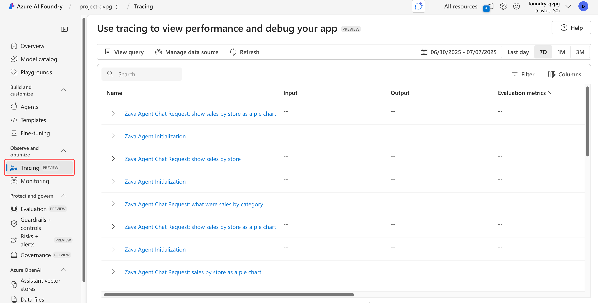
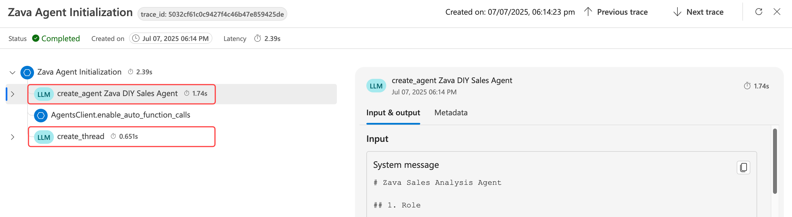

## Introduction

TODO - The fix is going to be to set the start of the finacial year for the company....

Tracing helps you understand and debug your agent's behavior by showing the sequence of steps, inputs, and outputs during execution. In Azure AI Foundry, tracing lets you observe how your agent processes requests, calls tools, and generates responses. You can use the Azure AI Foundry portal or integrate with OpenTelemetry and Application Insights to collect and analyze trace data, making it easier to troubleshoot and optimize your agent.

<!-- ## Lab Exercise

=== "Python"

      1. Open the `app.py` file.
      2. Change the `AZURE_TELEMETRY_ENABLED` variable to `True` to enable tracing:

         ```python
         AZURE_TELEMETRY_ENABLED = True
         ```

        !!! info "Note"
            This setting enables telemetry for your agent. In the `initialize` function in `app.py`, the telemetry client is configured to send data to Azure Monitor.

            ```python
             if AZURE_TELEMETRY_ENABLED:
                 configure_azure_monitor(connection_string=await self.project_client.telemetry.get_connection_string())
            ```         

=== "C#"

      tbd -->

## Run the Agent App

1. Press <kbd>F5</kbd> to run the app.
2. Select **Preview in Editor** to open the agent app in a new editor tab.

### Start a Conversation with the Agent

Copy and paste the following prompt into the agent app to start a conversation:

```plaintext
Write an executive report that analysis the top 5 product categories and compares performance of the online store verses the average for the physical stores.
```

## View Traces

You can view the traces of your agent's execution in the Azure AI Foundry portal or by using OpenTelemetry. The traces will show the sequence of steps, tool calls, and data exchanged during the agent's execution. This information is crucial for debugging and optimizing your agent's performance.

### Using Azure AI Foundry Portal

To view traces in the Azure AI Foundry portal, follow these steps:

1. Navigate to the **[Azure AI Foundry](https://ai.azure.com/) portal.
2. Select your project.
3. Select the **Tracing** tab in the left-hand menu.
4. Here, you can see the traces generated by your agent.

   

### Drilling Down into Traces

1. You may need to click on the **Refresh** button to see the latest traces as traces may take a few moments to appear.
2. Select the trace named `Zava Agent Initialization` to view the details.
   
3. Select the `creare_agent Zava DIY Sales Agent` trace to view the details of the agent creation process. In the `Input & outputs` section, you'll see the Agent instructions.
4. Next, select the `Zava Agent Chat Request: Write an executive...` trace to view the details of the chat request. In the `Input & outputs` section, you'll see the user input and the agent's response.

<!-- https://learn.microsoft.com/en-us/azure/ai-foundry/how-to/continuous-evaluation-agents -->